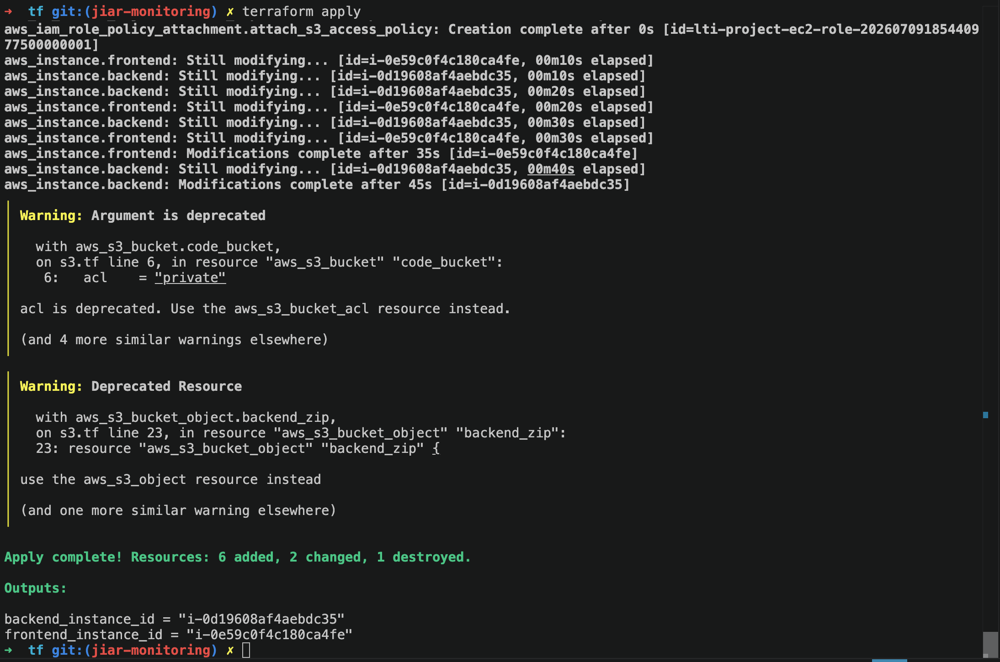
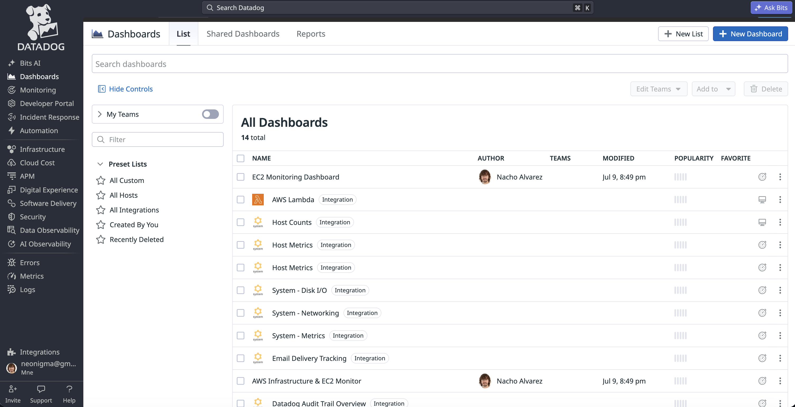
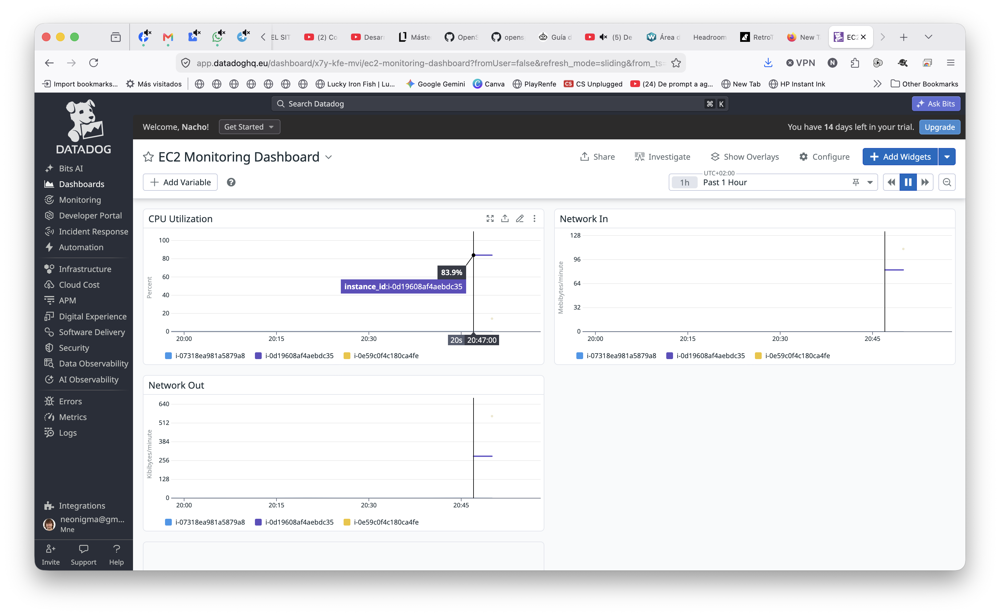
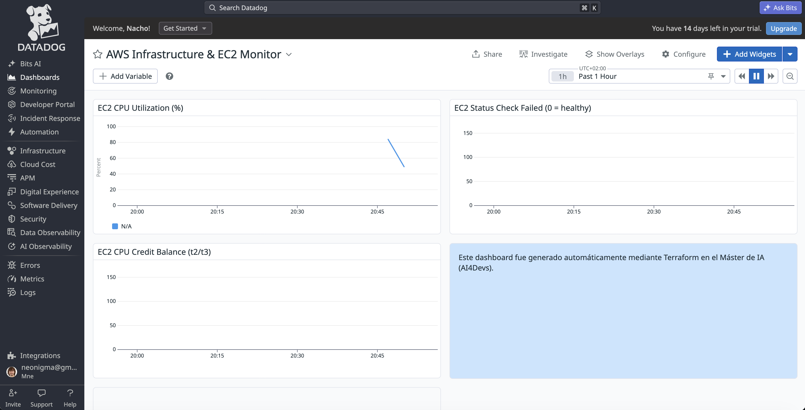

# Ejercicio de Monitorización: Integración AWS-Datadog (Máster de IA)

Esta sección documenta el trabajo realizado sobre el código Terraform del directorio [`tf/`](./tf) para instrumentar la infraestructura AWS existente (2 instancias EC2, backend y frontend) con Datadog.

## Resumen de cambios

### 1. Configuración base del provider de Datadog

- [`tf/provider.tf`](./tf/provider.tf): bloque `terraform { required_providers }` con los providers `aws` y `datadog`, y el bloque `provider "datadog"` configurado con `api_key`, `app_key` y `api_url` parametrizados.
- [`tf/variables.tf`](./tf/variables.tf): variables `datadog_api_key` y `datadog_app_key` (marcadas `sensitive = true`, **sin valor por defecto**) y `datadog_api_url` (con default configurable según la región de la cuenta Datadog, US o EU).
- Los valores reales se inyectan localmente mediante `tf/terraform.tfvars`, que **no se versiona** (está en `.gitignore`); se incluye `tf/terraform.tfvars.example` como plantilla sin secretos.

### 2. Integración nativa AWS ↔ Datadog

- [`tf/datadog_integration.tf`](./tf/datadog_integration.tf): implementa la integración a nivel de cuenta mediante el recurso `datadog_integration_aws_account` (el reemplazo actual del recurso `datadog_integration_aws`, deprecado en la versión del provider usada).
  - Datadog registra la cuenta AWS y genera un `external_id`.
  - Se crea un `aws_iam_role` cuya trust policy solo permite `sts:AssumeRole` al principal fijo de Datadog (`arn:aws:iam::464622532012:root`), condicionado a que el `sts:ExternalId` coincida con el generado por Datadog.
  - Se adjunta al rol una `aws_iam_policy` con los permisos mínimos estándar para lectura de métricas (`cloudwatch:Describe*/Get*/List*`, `ec2:Describe*`, `tag:Get*`).
  - El nombre del rol y las regiones a monitorizar son parametrizables vía variables (`datadog_aws_integration_role_name`, `datadog_aws_integration_included_regions`).

### 3. Agente Datadog en las instancias EC2

- [`tf/ec2.tf`](./tf/ec2.tf) y [`tf/scripts/backend_user_data.sh`](./tf/scripts/backend_user_data.sh) / [`tf/scripts/frontend_user_data.sh`](./tf/scripts/frontend_user_data.sh): el `user_data` de ambas instancias instala el Datadog Agent 7 mediante el instalador oficial (`install.datadoghq.com`), habilita y arranca el servicio (`systemctl enable/start datadog-agent`).
- La API Key y el site de Datadog (`DD_API_KEY`, `DD_SITE`) se inyectan de forma dinámica en el script vía `templatefile()`, a partir de `var.datadog_api_key` y de un valor derivado de `var.datadog_api_url` — nunca hardcodeados en el script.

### 4. Dashboards

- [`tf/main.tf`](./tf/main.tf): dashboard `EC2 Monitoring Dashboard` con CPU / Network In / Network Out de todas las instancias.
- [`tf/datadog_dashboards.tf`](./tf/datadog_dashboards.tf): dashboard `AWS Infrastructure & EC2 Monitor`, filtrado específicamente por el tag `name:lti-project-*` de nuestras instancias, con 4 widgets: uso de CPU, status check (salud de la instancia), créditos de CPU (instancias `t2`) y una nota de texto indicando que el dashboard se generó automáticamente vía Terraform en el Máster de IA.

## Capturas






## Desafíos y Soluciones

**Inyección segura de la API Key en el `user_data`.** El script de arranque original de las instancias contenía la API Key de Datadog hardcodeada en texto plano y, además, la línea de instalación del agente estaba mal formada (`export DD_SITE=... bash -c "..."`), por lo que el agente nunca llegaba a instalarse pese a que el código lo aparentaba. Se resolvió pasando la key como variable de Terraform marcada `sensitive`, sin valor por defecto, inyectándola en el script mediante `templatefile()` (el mismo mecanismo ya usado para el timestamp de forzado de despliegue) en lugar de interpolación de cadenas manual. La key en sí se mantiene fuera de git en todo momento: vive únicamente en `terraform.tfvars` (excluido vía `.gitignore` junto con `*.tfstate`, que por error había quedado versionado con estado de una cuenta AWS distinta a la de destino).

**Gestión de permisos IAM.** Se optó por el flujo de integración "account-level" moderno de Datadog (`datadog_integration_aws_account`) en lugar del recurso legacy, y por una política de permisos mínima y explícita (solo lectura de CloudWatch/EC2/tags) en vez de la política completa "de todo" que ofrece el asistente de la consola de Datadog (que incluye decenas de permisos adicionales para CSPM, X-Ray, forwarding de logs vía Lambda, etc., innecesarios para este ejercicio). El acceso del rol está además condicionado por `external_id`, evitando el problema del "confused deputy" en la relación de confianza entre cuentas. Durante el proceso también se detectó que las credenciales AWS activas apuntaban a una cuenta y usuario distintos a los del alumno (sin permisos IAM suficientes); una vez corregido el perfil de AWS CLI a la cuenta personal, la integración y el resto de recursos se desplegaron sin fricción.


# LTI - Talent Tracking System  | EN

This project is a full-stack application with a React frontend and an Express backend using Prisma as an ORM. The frontend is initiated with Create React App, and the backend is written in TypeScript.

## Directory and File Explanation

- `backend/`: Contains the server-side code written in Node.js.
  - `src/`: Contains the source code for the backend.
    - `index.ts`: The entry point for the backend server.
    - `application/`: Contains the application logic.
    - `domain/`: Contains the business logic.
    - `infrastructure/`: Contains code that communicates with the database.
    - `presentation/`: Contains code related to the presentation layer (such as controllers).
    - `routes/`: Contains the route definitions for the API.
    - `tests/`: Contains test files.
  - `prisma/`: Contains the Prisma schema file for ORM.
  - `tsconfig.json`: TypeScript configuration file.
- `frontend/`: Contains the client-side code written in React.
  - `src/`: Contains the source code for the frontend.
  - `public/`: Contains static files such as the HTML file and images.
  - `build/`: Contains the production-ready build of the frontend.
- `.env`: Contains the environment variables.
- `docker-compose.yml`: Contains the Docker Compose configuration to manage your application's services.
- `README.md`: This file contains information about the project and instructions on how to run it.

## Project Structure

The project is divided into two main directories: `frontend` and `backend`.

### Frontend

The frontend is a React application, and its main files are located in the `src` directory. The `public` directory contains static assets, and the build directory contains the production `build` of the application.

### Backend

The backend is an Express application written in TypeScript. The `src` directory contains the source code, divided into several subdirectories:

- `application`:Contains the application logic.
- `domain`: Contains the domain models.
- `infrastructure`: Contains code related to the infrastructure.
- `presentation`: Contains code related to the presentation layer.
- `routes`: Contains the application's routes.
- `tests`: Contains the application's tests.

The `prisma` directory contains the Prisma schema.

You can find more information about good practices in the [good practices guide](./backend/ManifestoBuenasPracticas.md).

The specifications for all API endpoints are in [api-spec.yaml](./backend/api-spec.yaml).

The description and diagram of the data model are in [ModeloDatos.md](./backend/ModeloDatos.md).

## First steps

To get started with this project, follow these steps:

1. Clone the repo
2. install the dependencias for frontend and backend
```sh
cd frontend
npm install

cd ../backend
npm install
```
3. Build the backend server
```
cd backend
npm run build
````
4. Run the backend server
```
cd backend
npm start
```
5. In a new terminal window, build the frontend server:
```
cd frontend
npm run build
```
6. Start the frontend server
```
cd frontend
npm start
```

The backend server will be running at http://localhost:3010, and the frontend will be available at http://localhost:3000.

## Docker y PostgreSQL

This project uses Docker to run a PostgreSQL database. Here's how to get it up and running:

Install Docker on your machine if you haven't done so already. You can download it here.
Navigate to the root directory of the project in your terminal.
Run the following command to start the Docker container:
```
docker-compose up -d
```

This will start a PostgreSQL database in a Docker container. The -d flag runs the container in detached mode, meaning it runs in the background.

To access the PostgreSQL database, you can use any PostgreSQL client with the following connection details:

- Host: localhost
- Port: 5432
- User: postgres
- Password: password
- Database: mydatabase

Please replace User, Password, and Database with the actual user, password, and database name specified in your .env file.

To stop the Docker container, run the following command:
```
docker-compose down
```

To generate the database using Prisma, follow these steps:

Make sure the `.env` file in the root directory of the backend contains the `DATABASE_URL` variable with the correct connection string to your PostgreSQL database. If it doesn't work, try replacing the full URL directly in `schema.prisma`, in the `url` variable.

Open a terminal and navigate to the backend directory where the schema.prisma and seed.ts files are located.

Run the following commands to generate the Prisma structure, apply migrations to your database, and populate it with example data:

```
npx prisma generate
npx prisma migrate dev
ts-node seed.ts
```

Once you have completed all the steps, you should be able to save new candidates, both via the web and API, view them in the database, and retrieve them via GET by ID.

```
POST http://localhost:3010/candidates
{
    "firstName": "Albert",
    "lastName": "Saelices",
    "email": "albert.saelices@gmail.com",
    "phone": "656874937",
    "address": "Calle Sant Dalmir 2, 5ºB. Barcelona",
    "educations": [
        {
            "institution": "UC3M",
            "title": "Computer Science",
            "startDate": "2006-12-31",
            "endDate": "2010-12-26"
        }
    ],
    "workExperiences": [
        {
            "company": "Coca Cola",
            "position": "SWE",
            "description": "",
            "startDate": "2011-01-13",
            "endDate": "2013-01-17"
        }
    ],
    "cv": {
        "filePath": "uploads/1715760936750-cv.pdf",
        "fileType": "application/pdf"
    }
}
```

# LTI - Sistema de Seguimiento de Talento  | ES

Este proyecto es una aplicación full-stack con un frontend en React y un backend en Express usando Prisma como un ORM. El frontend se inicia con Create React App y el backend está escrito en TypeScript.

## Explicación de Directorios y Archivos

- `backend/`: Contiene el código del lado del servidor escrito en Node.js.
  - `src/`: Contiene el código fuente para el backend.
    - `index.ts`: El punto de entrada para el servidor backend.
    - `application/`: Contiene la lógica de aplicación.
    - `domain/`: Contiene la lógica de negocio.
    - `infrastructure/`: Contiene código que se comunica con la base de datos.
    - `presentation/`: Contiene código relacionado con la capa de presentación (como controladores).
    - `routes/`: Contiene las definiciones de rutas para la API.
    - `tests/`: Contiene archivos de prueba.
  - `prisma/`: Contiene el archivo de esquema de Prisma para ORM.
  - `tsconfig.json`: Archivo de configuración de TypeScript.
- `frontend/`: Contiene el código del lado del cliente escrito en React.
  - `src/`: Contiene el código fuente para el frontend.
  - `public/`: Contiene archivos estáticos como el archivo HTML e imágenes.
  - `build/`: Contiene la construcción lista para producción del frontend.
- `.env`: Contiene las variables de entorno.
- `docker-compose.yml`: Contiene la configuración de Docker Compose para gestionar los servicios de tu aplicación.
- `README.md`: Este archivo, contiene información sobre el proyecto e instrucciones sobre cómo ejecutarlo.

## Estructura del Proyecto

El proyecto está dividido en dos directorios principales: `frontend` y `backend`.

### Frontend

El frontend es una aplicación React y sus archivos principales están ubicados en el directorio `src`. El directorio `public` contiene activos estáticos y el directorio `build` contiene la construcción de producción de la aplicación.

### Backend

El backend es una aplicación Express escrita en TypeScript. El directorio `src` contiene el código fuente, dividido en varios subdirectorios:

- `application`: Contiene la lógica de aplicación.
- `domain`: Contiene los modelos de dominio.
- `infrastructure`: Contiene código relacionado con la infraestructura.
- `presentation`: Contiene código relacionado con la capa de presentación.
- `routes`: Contiene las rutas de la aplicación.
- `tests`: Contiene las pruebas de la aplicación.

El directorio `prisma` contiene el esquema de Prisma.

Tienes más información sobre buenas prácticas utilizadas en la [guía de buenas prácticas](./backend/ManifestoBuenasPracticas.md).

Las especificaciones de todos los endpoints de API los tienes en [api-spec.yaml](./backend/api-spec.yaml).

La descripción y diagrama del modelo de datos los tienes en [ModeloDatos.md](./backend/ModeloDatos.md).


## Primeros Pasos

Para comenzar con este proyecto, sigue estos pasos:

1. Clona el repositorio.
2. Instala las dependencias para el frontend y el backend:
```sh
cd frontend
npm install

cd ../backend
npm install
```
3. Construye el servidor backend:
```
cd backend
npm run build
````
4. Inicia el servidor backend:
```
cd backend
npm start
```
5. En una nueva ventana de terminal, construye el servidor frontend:
```
cd frontend
npm run build
```
6. Inicia el servidor frontend:
```
cd frontend
npm start
```

El servidor backend estará corriendo en http://localhost:3010 y el frontend estará disponible en http://localhost:3000.

## Docker y PostgreSQL

Este proyecto usa Docker para ejecutar una base de datos PostgreSQL. Así es cómo ponerlo en marcha:

Instala Docker en tu máquina si aún no lo has hecho. Puedes descargarlo desde aquí.
Navega al directorio raíz del proyecto en tu terminal.
Ejecuta el siguiente comando para iniciar el contenedor Docker:
```
docker-compose up -d
```
Esto iniciará una base de datos PostgreSQL en un contenedor Docker. La bandera -d corre el contenedor en modo separado, lo que significa que se ejecuta en segundo plano.

Para acceder a la base de datos PostgreSQL, puedes usar cualquier cliente PostgreSQL con los siguientes detalles de conexión:
 - Host: localhost
 - Port: 5432
 - User: postgres
 - Password: password
 - Database: mydatabase

Por favor, reemplaza User, Password y Database con el usuario, la contraseña y el nombre de la base de datos reales especificados en tu archivo .env.

Para detener el contenedor Docker, ejecuta el siguiente comando:
```
docker-compose down
```

Para generar la base de datos utilizando Prisma, sigue estos pasos:

1. Asegúrate de que el archivo `.env` en el directorio raíz del backend contenga la variable `DATABASE_URL` con la cadena de conexión correcta a tu base de datos PostgreSQL. Si no te funciona, prueba a reemplazar la URL completa directamente en `schema.prisma`, en la variable `url`.

2. Abre una terminal y navega al directorio del backend donde se encuentra el archivo `schema.prisma` y `seed.ts`.

3. Ejecuta los siguientes comandos para generar la estructura de prisma, las migraciones a tu base de datos y poblarla con datos de ejemplo:
```
npx prisma generate
npx prisma migrate dev
ts-node seed.ts
```

Una vez has dado todos los pasos, deberías poder guardar nuevos candidatos, tanto via web, como via API, verlos en la base de datos y obtenerlos mediante GET por id. 

```
POST http://localhost:3010/candidates
{
    "firstName": "Albert",
    "lastName": "Saelices",
    "email": "albert.saelices@gmail.com",
    "phone": "656874937",
    "address": "Calle Sant Dalmir 2, 5ºB. Barcelona",
    "educations": [
        {
            "institution": "UC3M",
            "title": "Computer Science",
            "startDate": "2006-12-31",
            "endDate": "2010-12-26"
        }
    ],
    "workExperiences": [
        {
            "company": "Coca Cola",
            "position": "SWE",
            "description": "",
            "startDate": "2011-01-13",
            "endDate": "2013-01-17"
        }
    ],
    "cv": {
        "filePath": "uploads/1715760936750-cv.pdf",
        "fileType": "application/pdf"
    }
}
```

